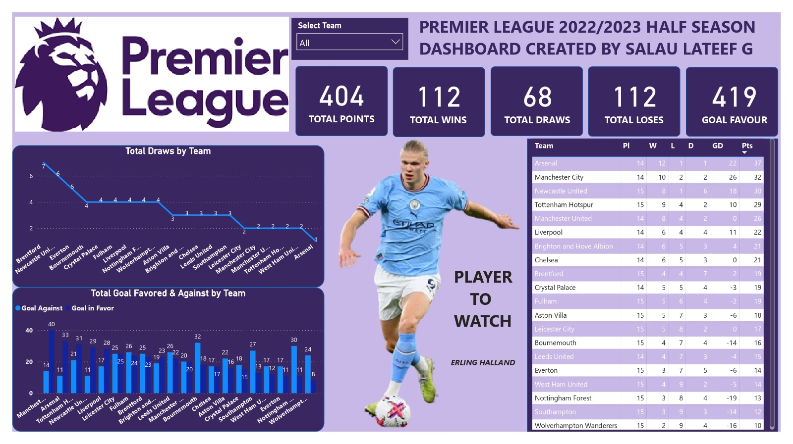

# Premier League Dashboard
 # .jpeg)  

## Introduction

The dataset contains 8 columns, it is the dataset of the premier league 2022/2023 half season. It was shared by one of my data communities BlackTECH Academy

The project is to analyze and derive insights to answer crucial questions and help the team management make data driven decions

**_Disclaimer_** : _All dataset and reports do not represent any company, institution or country, but just a dummy dataset gotten online to demonstate the capabilities of Power BI._

## Problem Statement 

which team has the highest point
which team has the highest goal
which team has the highest goal favor
which team has the highest goal against
which team has the highest game win

## Skills / Concept demonstrated

The following Power Bi features were incoporated: 
- DAX
- Quick Measure
- Modelling
- Filters
- Formatting

## Visualization

The report comprises of a page

- Overall Total Wins is currently at 112, and Total Wins for Team Arsenal is significantly higher than other teams at 12
- Overall Total Draws is currently at 68, and Total Draws for Team Brentford is significantly higher than other team at 7.
- Overall Goal Favor is currently at 419, and Goal Favor for Team Manchester City is significantly higher than other segment at 40.

You can interact with the report here: https://www.novypro.com/project/premier-leage-20222023-half-season-dashboard-

THANK YOU 😄

Chat me up on Linkedln: http://linkedin.com/in/salau-gideon-ond-aat-bsc-and-aca-in-view-330a4a1a0

Twitter: @LateefGideon

Whatsapp: 08100657265

